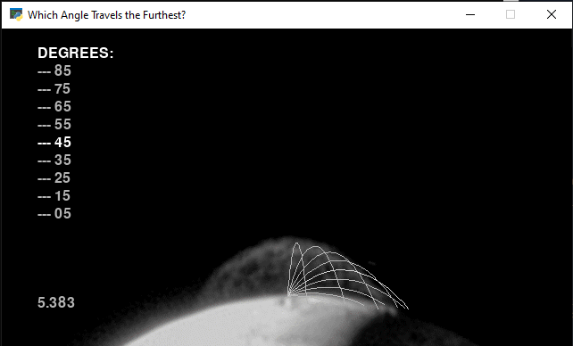
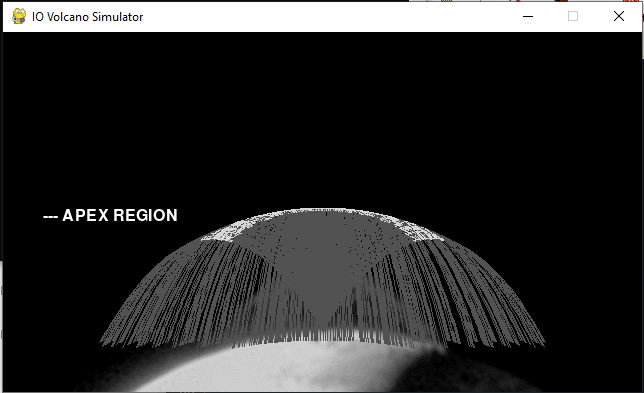

# Chapter 13
- Background image available at: https://github.com/rlvaugh/Impractical_Python_Projects/blob/master/Chapter_13/tvashtar_plume.gif
## Programs
- tvashtar.py - Main Project
- going_the_distance.py - Practice Project
- shock_canopy.py - Highlight apex region in arc - Challenge Project

### going_the_distance.py - Which angle in degrees will travel furthest (45 highlighted white)

</img>

### shock_canopy.py - Highlight only the apex regions of each particle trajectory

</img>

